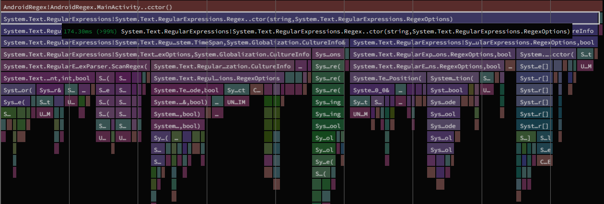

# AndroidRegex

Testing .NET 7 `Regex` on Android.

For details, see: https://devblogs.microsoft.com/dotnet/regular-expression-improvements-in-dotnet-7/

```csharp
private static readonly Regex s_myCoolRegex = new Regex("abc|def", RegexOptions.Compiled | RegexOptions.IgnoreCase);
...
if (s_myCoolRegex.IsMatch(text)) { ... }
```

VS the new hotness:

```csharp
[RegexGenerator("abc|def", RegexOptions.IgnoreCase)]
private static partial Regex MyCoolRegex();
...
if (MyCoolRegex().IsMatch(text)) { ... }
```

## Before (`RegexOptions.Compiled`)

`dotnet-trace` output:



Startup time on a Pixel 5 device, average of 10 runs:

```
Average(ms): 307.9
Std Err(ms): 2.38723456930585
Std Dev(ms): 7.54909854809757
```

## After (`[GeneratedRegex]`)

Startup time on a Pixel 5 device, average of 10 runs:

```
Average(ms): 214.4
Std Err(ms): 3.06666666666667
Std Dev(ms): 9.69765149118303
```

This results in a ~93.5ms savings to startup time.
